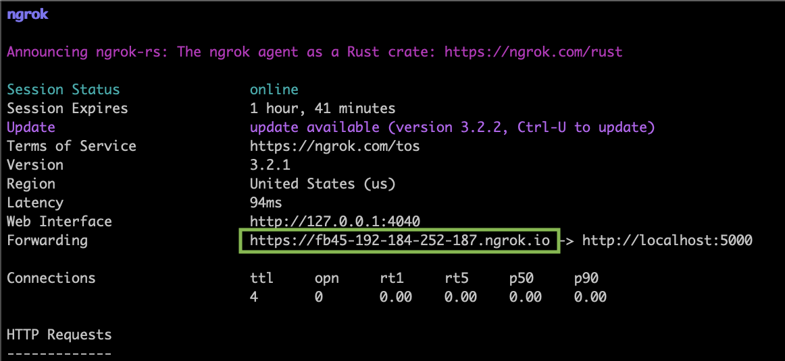
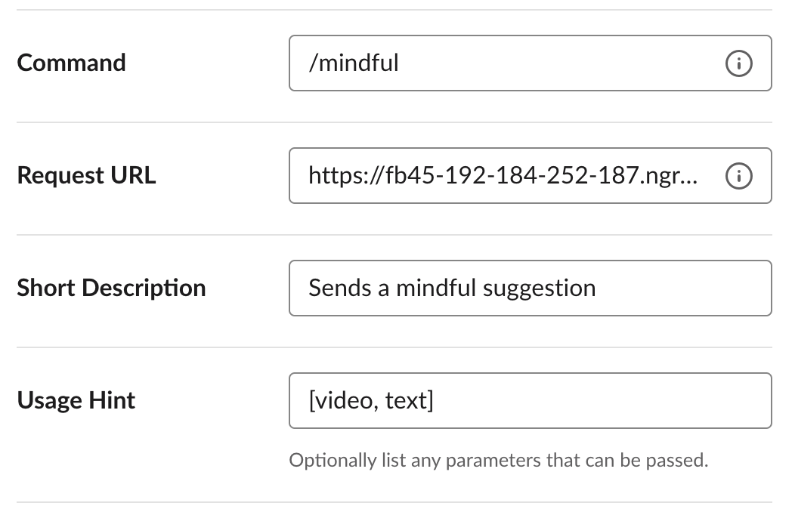
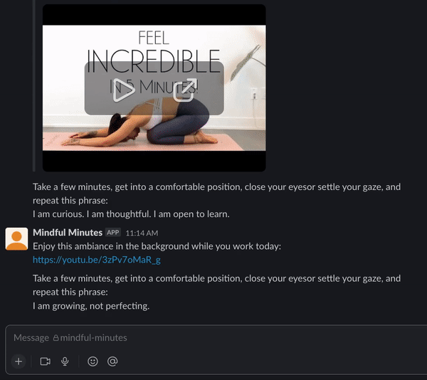

# Mindful Bot

This was a hackday project I worked on to help integrate more mindfulness into my workday. 
My focus was to gain experience with Flask, SQLAlchemy, and Slack's slash commands. I did 
not focus on getting this production-ready, but it could be expanded to be deployed into a 
production environment.


# Running locally
To get this to work locally you will need a [slack app](https://api.slack.com/start/overview#creating) 
installed to your workspace with the necessary scopes to send messages. See slack's documentation 
for more information.

You will also need [ngrok](https://ngrok.com/) to tunnel requests from a public URL to your app

## Set up a virtual environment and pip install the requirements
```
$ python -m venv .venv/
$ source .venv/bin/activate
$ pip install -r requirements.txt
```

## Export your app's token information
```
$ export SLACK_BOT_TOKEN=<your token>
$ export SLACK_SIGNING_SECRET=<your signing secret>
```

## Open a new terminal tab and start the flask app from top directory
```
$ flask --app mindful_bot run --debug
```

## Open a new terminal tab and start ngrok
```
$ ngrok http 5000
```


**^ NOTE: Save the ngrok url. This will be used in the next step.**


## Add the /mindful slash command to your slack app.


**^ NOTE: The request url should be in this format: ```<ngrock url>/mindful```**

## Invite the bot to a channel and try out the fancy new /mindful command!
